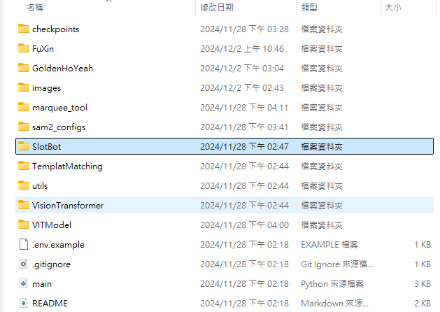

# SlotGame_AutoBot
# 自動化轉輪機器人 產學案

**可用branches已經依照各組別名稱創立**
可依照需求自行放上文件及程式碼

**遊戲素材蒐集**
原則以模擬器截取橫版/直版，1920*1080
資料夾'material'依需求放入分割完元件或是遊戲畫面截圖

**SlotBot使用方式**
SlotBot folder: 模組化操作元件辨識，須將模組如圖放置

，VIT模型檔下載路徑如下
使用Bluestacks模擬器執行遊戲(不能覆蓋其他視窗在上面)，運行main.py即可執行，
元件指令如下
    # 4. 操控遊戲
    GameController.Windowcontrol(GameController,highest_confidence_images=highest_confidence_images, classId=8)
更換classId 使用底下編號與按鍵對應表
        label_map = {
                    0: "button_max_bet",
                    1: "button_additional_bet",
                    2: "button_close",
                    3: "confirm",
                    4: "button_decrease_bet",
                    5: "button_home",
                    6: "button_increase_bet",
                    7: "button_info",
                    8: "receive",
                    9: "button_speedup_spin",
                    10: "button_start_spin",
                    11: "button_three_dot",
                    12: "gold_coin",
                    13: "gold_ingot",
                    14: "stickers",
                }

最新VIT模型下載路徑
https://drive.google.com/drive/folders/1cPY8fSodutPBDmM-59n8rNku8dqUU7pP?usp=sharing
