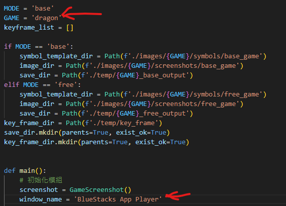
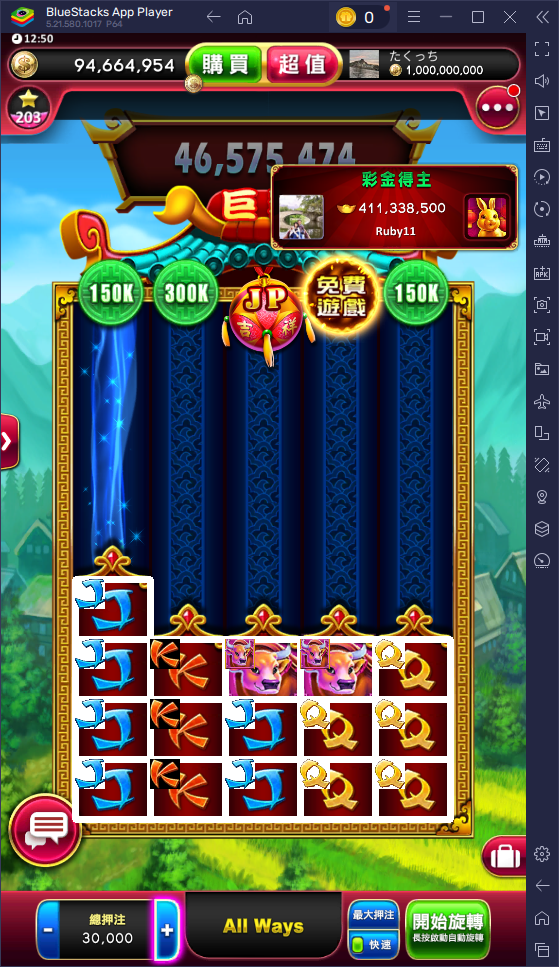

# SlotGame_AutoBot
# 自動化轉輪機器人 產學案

**可用branches已經依照各組別名稱創立**
可依照需求自行放上文件及程式碼

**遊戲素材蒐集**
原則以模擬器截取橫版/直版，1920*1080
資料夾'material'依需求放入分割完元件或是遊戲畫面截圖

**SlotBot使用方式**
#### 1. 專案pull下來後放入SAM以及VIT模型:
   sam2/checkpoints/VITModel三個資料夾雲端連結位置 : https://drive.google.com/drive/folders/1cPY8fSodutPBDmM-59n8rNku8dqUU7pP?usp=sharing)
   請先從上方google雲端連結下載三個資料夾，將下載下的資料夾(sam2/checkpoints/VITModel)放入專案資料夾SlotGame_AutoBot下

#### 2. 機器人所需之python模組requirement.txt : https://drive.google.com/file/d/1FqC1r0tOwh8t3mxu6ugXdomLrmyZYLka/view
#### 3. 請在SlotGame_AutoBot\SlotBot_combined\value_recognition.py內，找到os.environ["OPENAI_API_KEY"] = ''處放入OpenAI api key
#### 4. 執行機器人請運行SlotGame_AutoBot\SlotBot_combined\main.py，在下圖展示請依照遊戲名稱更換
```
bull
dragon
fu
golden
banana_town
GodOfWarThor
LuckyDuckLoot_Pick_em
Milion Book1115
Plusz_CoinStrikeHoldAndWin
Plusz_CoinVolcano
Plusz_HotToBurn
Plusz_immortalWayBuffalo
Plusz_joker_sJewels
Plusz_LegendOfRa
VIVA FROEST VEGAS
witch_forest
```
window_name = ' '內部填入模擬器視窗名稱
spin_round = 請填入運行的輪數，10輪以上才能輸出正確的excel數值


#### 5. 初次執行清空設定檔:
   1. SlotBot_combined\Symbol_recognition\grids
   2. SlotGame_AutoBot\json
   內的檔案在初次執行時請記得清空內部檔案，當今天盤面建立失敗，下次執行時請記得清空第一個路徑，如果數值對應位置錯誤，則清空第二個路徑
#### 6. 輸出路徑
   SlotGame_AutoBot\excel內會放入執行完成的結果報表
   SlotGame_AutoBot\temp內會依照遊戲名稱建立子資料夾，例如bull_base_output(牛轉乾坤base遊戲)，裡面會依照該輪辨識楨保存結果，如下圖

### 確認SAM 2.0模組正確安裝(IF 曾有裝載過舊版本SAM)
SAM 請安裝模組完成後，確認路徑指向正確，這邊使用pip show sam-2可以去看到模組正確路徑。
如果遇到同時安裝SAM2、SAM2.1兩版本工具，會依照模組路徑為主


### 放置方式如下圖


使用Bluestacks模擬器執行遊戲(不能覆蓋其他視窗在上面)，運行SlotGame_AutoBot-combined_grid_module/SlotBot_combined/main.py即可執行，
操作元件對應圖如下
### json統一輸出路經應在專案目錄下output資料夾，依照GAME(main.py的設定參數)新建該遊戲資料夾
.png)

```
        label_map = {
                    0: "button_max_bet",
                    1: "button_additional_bet",
                    2: "button_close",
                    3: "confirm",
                    4: "button_decrease_bet",
                    5: "button_home",
                    6: "button_increase_bet",
                    7: "button_info",
                    8: "receive",
                    9: "button_speedup_spin",
                    10: "button_start_spin",
                    11: "button_three_dot",
                    12: "gold_coin",
                    13: "gold_ingot",
                    14: "stickers",
                }
```


