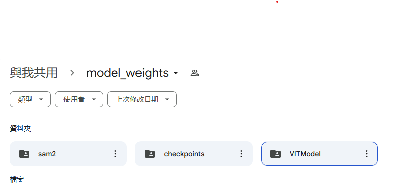
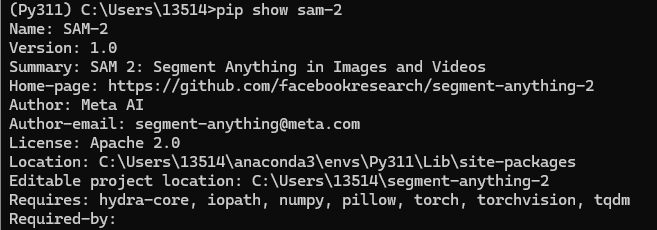
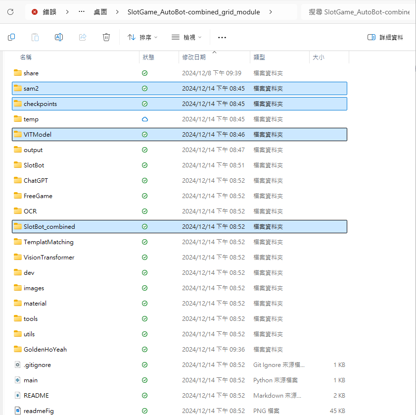

# SlotGame_AutoBot
# 自動化轉輪機器人 產學案

**可用branches已經依照各組別名稱創立**
可依照需求自行放上文件及程式碼

**遊戲素材蒐集**
原則以模擬器截取橫版/直版，1920*1080
資料夾'material'依需求放入分割完元件或是遊戲畫面截圖

**SlotBot使用方式**
SlotBot folder: 模組化操作元件辨識，須將模組(sam2/checkpoints/VITModel資料夾放入SlotGame_AutoBot-combined_grid_module專案資料夾內，sam2/checkpoints/VITModel資料夾雲端連結位置:https://drive.google.com/drive/folders/1cPY8fSodutPBDmM-59n8rNku8dqUU7pP?usp=sharing)


### 確認SAM 2.0模組正確安裝(IF 曾有裝載過舊版本SAM)
SAM 請安裝模組完成後，確認路徑指向正確，這邊使用pip show sam-2可以去看到模組正確路徑。
如果遇到同時安裝SAM2、SAM2.1兩版本工具，會依照模組路徑為主



### 放置方式如下圖


使用Bluestacks模擬器執行遊戲(不能覆蓋其他視窗在上面)，運行SlotGame_AutoBot-combined_grid_module/SlotBot_combined/main.py即可執行，
操作元件對應圖如下
### json統一輸出路經應在專案目錄下output資料夾，依照GAME(main.py的設定參數)新建該遊戲資料夾
.png)

```
        label_map = {
                    0: "button_max_bet",
                    1: "button_additional_bet",
                    2: "button_close",
                    3: "confirm",
                    4: "button_decrease_bet",
                    5: "button_home",
                    6: "button_increase_bet",
                    7: "button_info",
                    8: "receive",
                    9: "button_speedup_spin",
                    10: "button_start_spin",
                    11: "button_three_dot",
                    12: "gold_coin",
                    13: "gold_ingot",
                    14: "stickers",
                }
```


